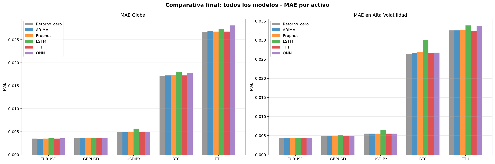

# Forecasting de series temporales financieras — Modelos clásicos, Deep Learning y QNN híbrida

Comparativa de seis métodos para predecir el retorno diario de tres pares Forex y dos criptomonedas: un baseline de retorno cero, ARIMA, Prophet, LSTM, una red inspirada en TFT y una red neuronal híbrida cuántico-clásica.

El proyecto analiza si aumentar la complejidad del modelo genera una mejora real fuera de muestra y cómo cambia el error durante periodos de alta volatilidad.

> Proyecto académico del Grado en Computación e Inteligencia Artificial. No constituye asesoramiento financiero ni un sistema de trading.

## Pregunta de investigación

> ¿Mejoran ARIMA, Prophet, una LSTM, una red temporal inspirada en TFT y una QNN híbrida el error de una predicción de retorno cero, y cambia el resultado durante periodos de alta volatilidad?

El retorno cero se utiliza como referencia principal. En series de retornos próximas a cero, un modelo puede superar a otros algoritmos y, aun así, no aportar valor frente a una predicción trivial.

## Activos y datos

| Activo | Mercado | Frecuencia |
|---|---|---|
| EUR/USD | Forex | Días de cotización |
| GBP/USD | Forex | Días de cotización |
| USD/JPY | Forex | Días de cotización |
| BTC/USD | Criptomonedas | Diaria |
| ETH/USD | Criptomonedas | Diaria |

- **Fuente:** Yahoo Finance mediante `yfinance`.
- **Periodo versionado:** enero de 2018 — marzo de 2026.
- **Variable objetivo:** variación porcentual diaria calculada mediante `pct_change()`.
- **Diferencia de calendarios:** las criptomonedas también cotizan durante los fines de semana.

Los CSV versionados permiten reproducir el análisis sin depender de una nueva descarga. El notebook 01 permite actualizar los datos originales.

## Protocolo temporal

Todos los modelos se evalúan con las mismas reglas:

1. Se eliminan únicamente las filas iniciales sin retorno o volatilidad de 20 días.
2. Se reserva cronológicamente el último 20 % de cada activo como conjunto de prueba.
3. Los escaladores de las redes neuronales se ajustan exclusivamente con el conjunto de entrenamiento.
4. El umbral de alta volatilidad se define mediante el percentil 70 calculado solo sobre entrenamiento.
5. Las redes utilizan una ventana de 20 retornos anteriores para predecir el retorno del día siguiente.
6. Los parámetros permanecen congelados durante la evaluación. Las ventanas *rolling* pueden incorporar cada retorno real una vez observado.
7. Se utilizan MAE y RMSE. MAPE no resulta adecuada para retornos próximos a cero o con cambios de signo.

`src/temporal.py` centraliza la división temporal, el escalado y la clasificación de los regímenes. Las pruebas automatizadas verifican que el escalador y el umbral de volatilidad no utilicen información del periodo de prueba.

## Modelos evaluados

| Modelo | Papel en el experimento |
|---|---|
| Retorno cero | Baseline principal |
| ARIMA | Modelo estadístico con selección de `(p,0,q)` por AIC dentro de entrenamiento |
| Prophet | Modelo aditivo entrenado únicamente con datos anteriores al test |
| LSTM | Red recurrente de dos capas y ventana temporal de 20 días |
| Red inspirada en TFT | Encoder LSTM, atención temporal y GRN simplificada |
| QNN híbrida | Compresión clásica, circuito variacional y capas clásicas de salida |

### Red inspirada en TFT

La implementación es una red educativa inspirada en algunos componentes del Temporal Fusion Transformer. No reproduce la arquitectura TFT completa: no incluye, por ejemplo, selección de variables, covariables futuras conocidas ni variables estáticas.

### QNN híbrida

La QNN utiliza:

- 6 qubits y 2 capas variacionales;
- rotaciones `RX`, `RY` y `RZ`;
- entrelazamiento circular mediante puertas `CNOT`;
- medición `PauliZ` de los 6 qubits;
- 169 parámetros entrenables: 36 cuánticos y 133 clásicos;
- simulador ideal `default.qubit`, no hardware cuántico real.

Su finalidad es comparar una arquitectura híbrida pequeña, no demostrar ventaja cuántica.

## Resultados

Los notebooks 02–06 se ejecutaron en orden utilizando el protocolo temporal corregido. La tabla muestra el MAE fuera de muestra. El mejor resultado de cada activo, calculado con los valores sin redondear, aparece en negrita.

| Activo | Retorno cero | ARIMA | Prophet | LSTM | Red inspirada en TFT | QNN híbrida |
|---|---:|---:|---:|---:|---:|---:|
| EUR/USD | 0,003498 | **0,003493** | 0,003508 | 0,003556 | 0,003519 | 0,003554 |
| GBP/USD | **0,003603** | 0,003604 | 0,003607 | 0,003631 | 0,003603 | 0,003670 |
| USD/JPY | 0,004869 | **0,004863** | 0,004865 | 0,005668 | 0,004863 | 0,004926 |
| BTC | **0,017193** | 0,017238 | 0,017375 | 0,017963 | 0,017243 | 0,017813 |
| ETH | **0,026714** | 0,026978 | 0,026787 | 0,027410 | 0,026784 | 0,028117 |



### Hallazgos principales

- **ARIMA** obtiene el menor MAE en EUR/USD y USD/JPY, aunque mejora el retorno cero únicamente un 0,14 % y un 0,12 %, respectivamente.
- **El retorno cero** consigue el menor error en GBP/USD, BTC y ETH.
- **Prophet** produce resultados próximos a ARIMA, pero no obtiene el mejor resultado global en ninguno de los activos.
- **El LSTM** no supera a los modelos clásicos ni al baseline en ninguno de los cinco activos.
- **La red inspirada en TFT** mejora al LSTM y se aproxima a los modelos sencillos, pero no aporta una ventaja consistente.
- **La QNN híbrida** no obtiene el menor MAE en ningún activo.

La QNN necesitó 558 minutos —9 horas y 18 minutos— para entrenar los cinco activos en el equipo utilizado. Este coste computacional fue muy superior al de las demás alternativas y no estuvo acompañado de una reducción del error.

En esta partición temporal, aumentar la complejidad del modelo no produce una mejora predictiva consistente. El resultado no demuestra que los modelos complejos sean inadecuados para las series financieras; se limita a los datos, variables, configuraciones y periodo evaluados.

Las métricas completas, incluidas RMSE y la segmentación por volatilidad, se encuentran en [`results/comparativa_final_todos_modelos.csv`](results/comparativa_final_todos_modelos.csv).

## Notebooks

Los notebooks deben ejecutarse en el siguiente orden:

```text
01_data_exploration.ipynb  Descarga, retornos, volatilidad y análisis descriptivo
02_arima.ipynb             ARIMA rolling y baseline de retorno cero
03_Prophet.ipynb           Prophet
04_lstm.ipynb              LSTM
05_tft.ipynb               Red temporal inspirada en TFT
06_qnn.ipynb               QNN híbrida y comparación final
```

Los modelos neuronales y, especialmente, la QNN pueden requerir bastante tiempo cuando se ejecutan en CPU.

## Instalación y ejecución

El proyecto se ha desarrollado y probado con Python 3.12 y PyTorch CPU.

```bash
python -m venv .venv
```

Activación en Linux o macOS:

```bash
source .venv/bin/activate
```

Activación en Windows PowerShell:

```powershell
.\.venv\Scripts\Activate.ps1
```

Instalación y apertura de Jupyter:

```bash
python -m pip install --upgrade pip
python -m pip install -r requirements.txt
python -m jupyter notebook
```

El baseline puede regenerarse independientemente mediante:

```bash
python run_baseline.py
```

## Pruebas rápidas

Las pruebas de prevención de fuga temporal no requieren instalar PyTorch, Prophet ni PennyLane:

```bash
python -m pip install -r requirements-test.txt
python -m pytest -q
python run_baseline.py
```

GitHub Actions valida las funciones temporales, la sintaxis de los notebooks y la compilación de los módulos en cada *push* a `main` y en cada *pull request*.

## Limitaciones

- Una única división 80/20 no cuantifica la variabilidad entre diferentes periodos de mercado.
- Las redes se entrenan con una sola semilla y sin una búsqueda sistemática de hiperparámetros.
- No se incluyen costes de transacción, *slippage* ni una estrategia de trading; un menor MAE no implica rentabilidad.
- El régimen de volatilidad es una segmentación descriptiva, no un estado de mercado conocido con certeza antes de realizar la predicción.
- La red inspirada en TFT no reproduce la arquitectura completa del Temporal Fusion Transformer.
- La QNN se ejecuta en un simulador ideal y no evalúa hardware cuántico real.
- Las diferencias pequeñas de MAE no permiten afirmar superioridad sin validación temporal repetida e intervalos de incertidumbre.

## Estructura del proyecto

```text
.
├── data/                    Datos descargados y procesados
├── notebooks/               Experimentos secuenciales
├── results/                 Métricas y figuras generadas
├── src/temporal.py          División, escalado y regímenes sin fuga
├── tests/                   Controles metodológicos
├── run_baseline.py          Baseline reproducible
└── requirements*.txt        Dependencias completas y de pruebas
```

## Autor

Jorge Galán Rodríguez — [GitHub](https://github.com/jorgegalanr) · [LinkedIn](https://linkedin.com/in/jorgegalanrodriguez)

## Licencia

MIT
